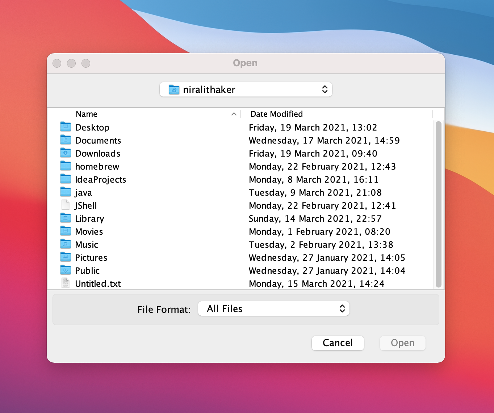
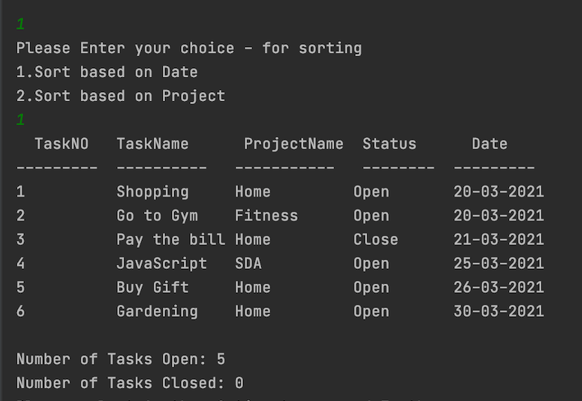
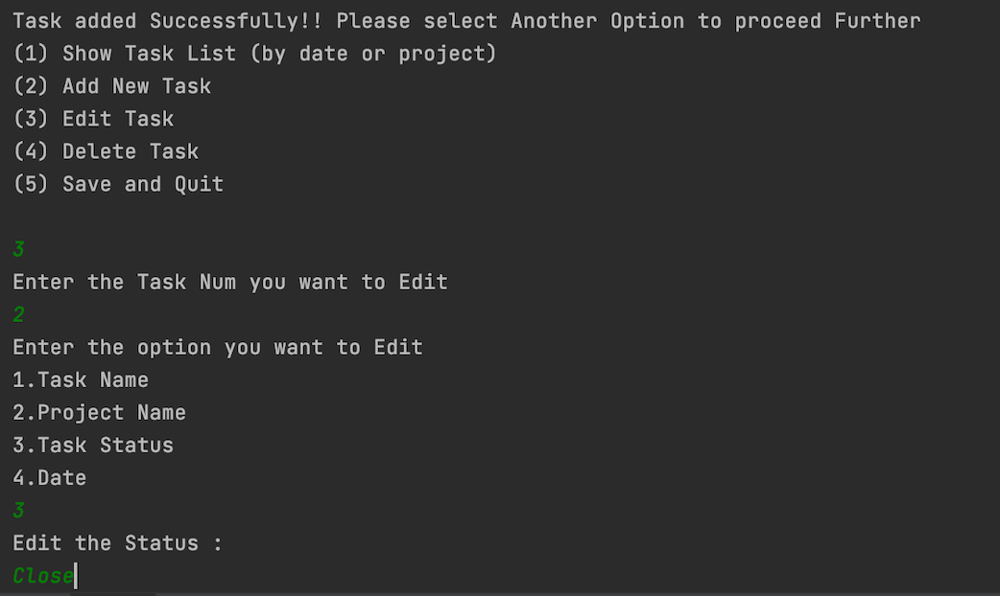
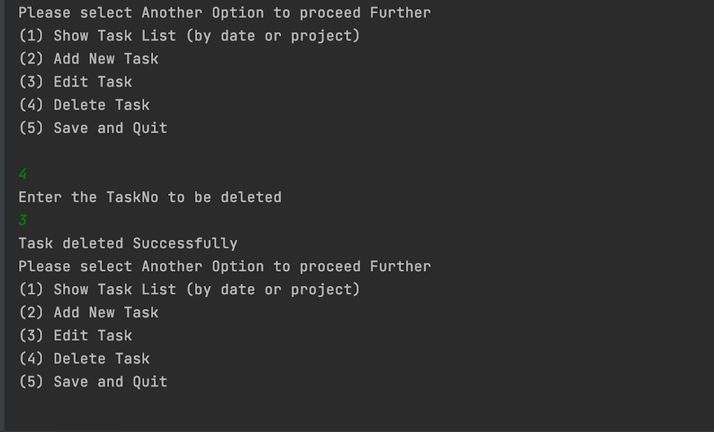
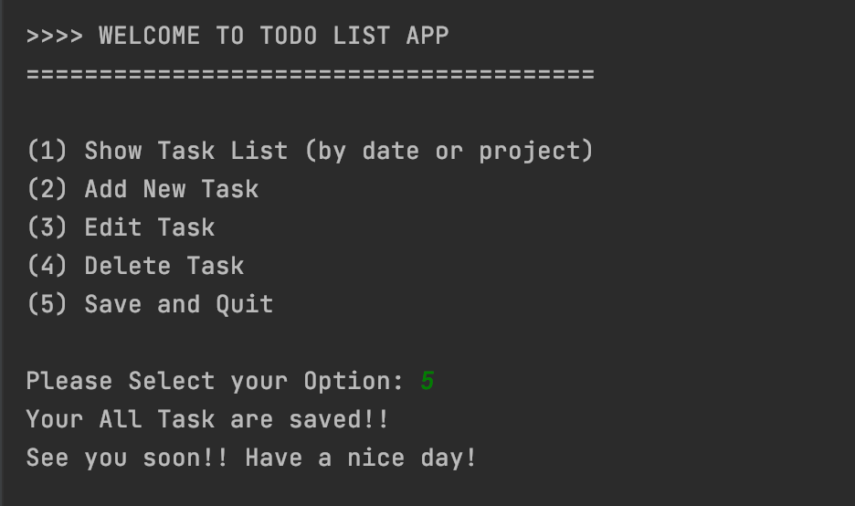

# Todo-List App

This application is a Java program to create and store you personal tasks as Todo List.

# Basic Overview:

This application has available option to select from Menu. This application has featured to save all User Tasks in the Data so when User open next time it will resume its state.

# Basic Features:

- Task Name
- Task Date
- Task Status
- Project Name

#Basic Functionality:
- add Task
- edit Task
- Save Task
- remove Task

# Built with

JDK 15.0.2
JUnit 5.7.1
Gradle 6.8.3
Git 2.24.3

# How to get started:

The application can be run directly via Gradle or via a generated Jar file.

#Run with Gradle

In the root folder, start application with Gradle Run command.
```bash
gradle run --console plain
````
#Run with Jar file

Generate the jar file with Gradle command
```bash
gradle build
```
The jar file will be generated in build/libs which can be run by a java environment.

```bash
   java -jar build/libs/todo-list-1.0-SNAPSHOT.jar
```

#User Manual

#Main Menu

As the Application starts running it shows window to select a .txt file to choose to input data.



The main menu will offer user 5 options to choose action.


Option 1: Show Task List 
If User will choose option 1 then it will show the list of Tasks already saved based on sorting based on the Date or the ProjectName.



Option 2: Add New Task
If User select option 2 then it will ask 
1. TaskName
2. ProjectName
3. TaskStatus
4. TaskDate

After adding all the fields properly Task will add to the TaskList.


Option 3: Edit Existing Task
If User select option 3 then it will ask User which TaskNo is to be edited.



Option 4: Delete Task
If User select option 4 then it will ask User which TaskNo is to be deleted.



Option 5: Save and Exit
If User select option 5 then all task added will be saved to the TaskList.



##Author 

Nirali Thaker

##Acknowledgments

Special Thank you to all the TAs and SDAmates for all the support.


